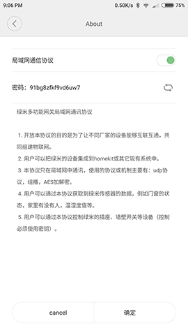
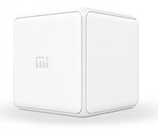

# Mi Home

This gem provides simple and flexible ruby API for Xiaomi Mi Home devices.  

Currently supports only Aqara(ZigBee gateway) devices and sensors. Please see the pictures below.


*Warning: This is experimental version. It may be very unstable*
## Installation

Add this line to your application's Gemfile:

```ruby
gem 'mi-home', git: "git@github.com:mykhailog/mi-home.git"
```

And then execute:

    $ bundle install


## Setup Gateway
Before starting to use this gem you should setup development mode on your gateway.

Here is instruction which I get from  [https://www.domoticz.com/wiki/Xiaomi_Gateway_(Aqara)]

1. Install the App on a Android/iOS device
2. Make sure you set your region to: Mainland China under settings -> Locale - at time of writing this seems to be required.
Mainland China and language can set on English
3. Select your Gateway in Mi Home
4. Then the 3 dots at the top right of the screen
5. Then click on about
6. Tap the version number at the bottom of the screen repeatedly
7. You should see now 2 extra options listed in English (was Chinese in earlier versions) until you did now enable the developer mode. [ if not try all steps again!]
8. Choose the first new option
9. Then tap the first toggle switch to enable LAN functions. Note down the password (91bg8zfkf9vd6uw7 in the screenshot). Make sure you hit the OK button (to the right of the cancel button) to save your changes.
10. If you change here something, you lose your password! 



Note that the gateway needs to be at least version 2. Radio support on the gateway indicates at least version 2. If you are unsure, please ask your supplier before purchasing
## Usage
### Getting started
```ruby
require 'mi_home'
platform = MiHome::AqaraPlatform.new(password: "91bg8zfkf9vd6uw7")
platform.connect

platform.devices.socket_plug.on!
# add event handler when user click on button
platform.devices.switch_button.click.register do
  light_switch = platform.devices.light_switch
  if light_switch.on?
     light_switch.off!
   else
     light_switch.on!
   end  
end
platform.join
```
or event simpler:
```ruby
require 'mi_home'
platform = MiHome::AqaraPlatform.new(password: "91bg8zfkf9vd6uw7")
platform.connect
platform.devices.with do
    socket_plug.on!
     switch_button.click.register do
      if light_switch.on?
         light_switch.off!
       else
         light_switch.on!
       end  
     end  
end
platform.join
```
### Device managing
If you have more than one device with the same type(e.g. two light swtiches,motion sensors, etc) you can find them using several methods:
1. Namify them and find by name
```ruby
platform = MiHome::AqaraPlatform.new(password: "91bg8zfkf9vd6uw7",
                                     names:{ living_room_light: "<sid of living room light>",
                                             bathroom_motion_sensor: "<sid of bathroom motion sensor>"

})
platform.connect
platform.devices.by_name(:living_room_light).off!
# or 
platform.devices[:living_room_light].off!
# or 
platform.devices.living_room_light.off!
```
You can get available devices and their sid using:
```ruby
puts platform.devices.all 
```
 2. Find by sid
```ruby
platform.devices.by_sid("a192as9sdass").off!
```
or
```ruby 
platform.devices["a192as9sdass"].off!
```
3. Get all by types
```ruby
platform.devices.by_type("light_switch").each do |light_switch|
 light_switch.off!
end
```
or
```
platform.devices.light_switch.each do |light_switch|
 light_switch.off!
end
```
*Warning:* Be careful when you have more than one device platform.devices.light_switch will return array instead device instance.
## Devices and sensors

### 1. Motion sensor


```ruby
platform.devices.motion_sensor.motion.register do
  puts "Someone moved in your wardrobe!"
end
```
### 2. Door/Window sensor


```ruby
magnet_sensor = platform.devices.magnet_sensor
magnet_sensor.open?   # is door opened
magnet_sensor.close?  # is door closed
magnet_sensor.open.register do
  puts "Someone opened your window!"
end
magnet_sensor.close.register do
  puts "Someone opened your window!"
end
```
### 3. Socket Plug


```ruby
socket_plug = platform.devices.socket_plug
socket_plug.on?  
socket_plug.off? 
socket_plug.used? # is socket plug in use
socket_plug.on.register do
 
end
socket_plug.off.register do
  
end

# To turn on/off socket plug use:
socket_plug.on!
socket_plug.off!
socket_plug.toggle!
# There are few properties which is not 
# available now but can be used in futures firmwares:
puts socket_plug.load_voltage
puts socket_plug.load_power
puts socket_plug.power_consumed
```
### 4. Temperature and humidity


```ruby
th_sensor = platform.devices.th_sensor
puts th_sensor.temperature
puts th_sensor.humidity
th_sensor.temperature_changed do |temperature|
  if temperature < 0
    puts "It it cold :("
  end
end
th_sensor.humidity_changed do |temperature|
  if temperature < 0
    puts "It it cold :("
  end
end
th_sensor.temperature = 100 # no you can't do this :) it raises error
```
### 5. Light switch

```ruby
light_switch = platform.devices.light_switch
light_switch.on?  
light_switch.off? 

light_switch.on.register do
 
end
light_switch.off.register do
  
end

# To turn on/off light switch use:
light_switch.on!
light_switch.off!
light_switch.toggle! 
```
### 6. Duplex light switch  

```ruby
duplex_light_switch = platform.devices.duplex_light_switch

duplex_light_switch.on?   # if all light switches are on
duplex_light_switch.off?  # if all light switches are off

duplex_light_switch.light1_on! # turn on first light switch
duplex_light_switch.light2_on! # turn on second light switch
duplex_light_switch.light1_on.register do 
  puts "Light #1 was turned on"
end
duplex_light_switch.light2_on.register do 
  puts "Light #2 was turned on"
end

duplex_light_switch.light1_off! # turn off first light switch
duplex_light_switch.light2_off! # turn off second light switch
duplex_light_switch.light2_off.register do 
  puts "Light #2 was turned off"
end
duplex_light_switch.light2_off.register do 
  puts "Light #2 was turned off"
end
```
### 6. Cube

```ruby
cube = platform.devices.cube
cube.rotate # rotation angle
cube.flip90.register {}
# the same for:
#  :flip180,
#  :move,
#  :tap_twice,
#  :shake_air,
#  :swing,
#  :alert,
#  :free_fall
```
### 7. Gateway


Gateway support if very limited right now. Maybe it changes in future firmware.
```ruby
gateway = platform.devices.gateway
gateway.on?  # is gateway lamp turned on
gateway.off? 
gateway.rgb  # rgb color of gateway lamp

# these properties is not supported yet but maybe will be supported in future
gateway.illumination 
```
### 8. Led Light

```ruby
    led_light = platform.devices.rgbw_light
    led_light.on? 
    led_light.on! # turn on light
    
    led_light.off? 
    led_light.off! # turn on light
    
    puts led_light.color_temperature 
    led_light.color_temperature = 65279
    puts led_light.level
    puts led_light.hue
    puts led_light.saturation
    puts led_light.x
    puts led_light.y
  
```
## Gateway passwords
If you have more than one gateway you should specify password for each of them:
```ruby
platform = MiHome::AqaraPlatform.new(password: {"<gateway1 sid>": "ABC1237123923A","<gateway2 sid>": "ABC123712B923A"})
```
If you don't need to do any write action (e.g. turn on/off the light) you may not specify any passwords:
```ruby
platform = MiHome::AqaraPlatform.new
```
## Disconnect
When you call _platform.connect_ method it automatically creates two threads one of it reads messages from gateway and second track device updates. To terminate threads and finish any processing use _platform.disconnect_ method.
```ruby
platform.connect
platform.devices.light_switch.off!
platform.disconnect
```
or
```ruby
platform.connect do
  platform.devices.light_switch.off!
end
```
## Force refresh
  All devices report time to time it's status. If you need immediately get sensor status call _device.refresh!_ method. 
```ruby
  platform.devices.th_sensor.refresh!
```
## TODO
- tests
- make it thread safe
- add exception handling
- add sync writing
- ...

## Contributing

Bug reports and pull requests are welcome on GitHub at https://github.com/mykhailog/mi-home

